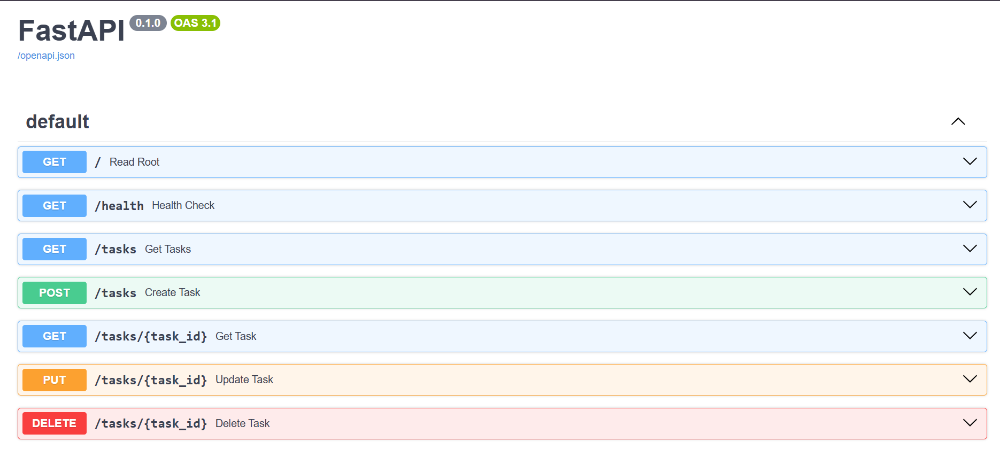

# Task API

A small to-do list API I built with Python and FastAPI. It can create, read, update, and delete tasks — the four basic things almost every backend does. Data is stored in memory only (a plain Python list), so it resets whenever the server restarts.

## How to run it

1. Make sure you have Python 3.10+ installed.
2. Install the dependencies:
   ```
   pip install fastapi uvicorn
   ```
3. Start the server:
   ```
   uvicorn main:app --reload
   ```
4. The API will be running at `http://localhost:8000`

That's it — one command (`uvicorn main:app --reload`) after the install.

## Endpoints

| Method | Path | What it does |
|--------|------|---------------|
| GET | `/` | Basic info about the API |
| GET | `/health` | Health check — returns `{"status": "ok"}` |
| GET | `/tasks` | Returns all tasks |
| GET | `/tasks/{id}` | Returns one task by id, or a 404 if it doesn't exist |
| POST | `/tasks` | Creates a new task. Requires a `title`; returns 400 if it's missing or empty |
| PUT | `/tasks/{id}` | Updates a task's title and done status. 404 if the id doesn't exist |
| DELETE | `/tasks/{id}` | Deletes a task. Returns 204 with no content. 404 if the id doesn't exist |

## Example request

Here's what creating a task actually looks like from the terminal:

```
curl -i -X POST http://localhost:8000/tasks -H "Content-Type: application/json" -d '{"title":"Buy milk"}'
```

Response:

```
HTTP/1.1 201 Created
content-type: application/json

{"id":4,"title":"test","done":false}
```


## Swagger UI

FastAPI automatically generates an interactive docs page at `http://localhost:8000/docs`. You can see every endpoint listed there and test them directly in the browser using the "Try it out" button — no curl required.



I tested the full CRUD cycle directly in this page: created a task, confirmed it showed up in the list, updated it, then deleted it — all without touching curl.

## A note on memory

Since there's no database yet, everything lives in a Python list while the server is running. If you restart the server, all your tasks — including anything you created — go back to the original 3 example tasks. Nothing is saved to disk. That's expected, and it's the whole reason a database gets introduced next.
